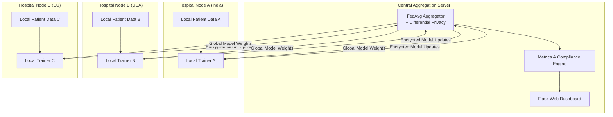

# Federated Healthcare Learning Framework — Implementation Plan

A secure, federated learning prototype enabling national healthcare institutions to collaboratively train a disease outbreak prediction model **without centralizing raw patient data**, with measurable privacy-accuracy trade-offs.

## Architecture Overview



### Core Design Decisions

| Decision | Choice | Rationale |
|----------|--------|-----------|
| FL Framework | **Custom (pure PyTorch)** | Full control over privacy mechanisms; no heavy external dependency |
| Model | **Neural Network (MLP)** | Good balance of expressiveness and trainability for tabular health data |
| Privacy | **Differential Privacy (ε-DP)** | Gold standard; mathematically provable privacy guarantees |
| Aggregation | **Federated Averaging (FedAvg)** | Well-understood, efficient, battle-tested |
| Secure Comms | **HMAC-signed + TLS-ready** | Integrity verification of model updates |
| Dashboard | **Flask + vanilla JS** | Lightweight, no heavy frontend build step |
| Data | **Synthetic patient data** | Realistic simulation without real PHI |

---

## User Review Required

> [!IMPORTANT]
> **No real patient data is used.** Synthetic data generators simulate realistic disease outbreak patterns across heterogeneous hospital populations (non-IID distributions).

> [!WARNING]
> **This is a research prototype**, not a production-ready system. In production, you would need TLS certificates, proper key management, an audit logging database, and legal review for each jurisdiction.

> [!IMPORTANT]
> **Privacy Budget (ε)**: The framework will sweep ε values from `0.1` (very private, noisy) to `10.0` (less private, accurate) to demonstrate the accuracy–leakage trade-off quantitatively.

---

## Proposed Changes

### 1. Core Federated Learning Engine

#### [NEW] [federated_engine.py](file:///c:/Project%20003/federated_engine.py)
Central module implementing:
- **`FederatedServer`** class — orchestrates training rounds, performs FedAvg aggregation, applies server-side differential privacy (Gaussian noise calibrated to sensitivity/ε)
- **`HospitalClient`** class — trains locally on synthetic patient data, clips gradients, sends model deltas
- **`DifferentialPrivacy`** utility — implements (ε, δ)-DP with Gaussian mechanism, gradient clipping (per-sample), and privacy accountant tracking cumulative budget
- **`SecureAggregator`** — HMAC-based integrity checks on model updates, simulated secure aggregation protocol

Key parameters:
- `num_rounds`: Number of federated rounds (default: 50)
- `num_clients`: Number of hospital nodes (default: 5)
- `epsilon`: Privacy budget (configurable, swept from 0.1–10.0)
- `delta`: Failure probability (default: 1e-5)
- `clip_norm`: Per-sample gradient clip (default: 1.0)
- `local_epochs`: Training epochs per round per client (default: 3)

---

### 2. Disease Outbreak Prediction Model

#### [NEW] [model.py](file:///c:/Project%20003/model.py)
PyTorch neural network for outbreak prediction:
- **`OutbreakPredictionModel`** — 3-layer MLP (128→64→32→1) with BatchNorm, ReLU, Dropout
- Input features: age, region_code, symptom_severity, temperature, contact_count, vaccination_status, comorbidity_index, population_density, travel_history
- Binary classification output: outbreak_risk (0/1)
- Loss: BCEWithLogitsLoss (handles class imbalance via pos_weight)

---

### 3. Synthetic Data Generation

#### [NEW] [data_generator.py](file:///c:/Project%20003/data_generator.py)
Generates realistic, heterogeneous patient datasets per hospital:
- Each hospital gets a **non-IID** data distribution (different age demographics, disease prevalence rates, regional patterns)
- Features: demographics, vitals, contact tracing metrics, vaccination data
- Labels: binary outbreak risk with configurable base rates per region
- Generates 5 hospital datasets with 2,000–5,000 patients each
- Saves to `data/hospital_X/` directories as CSV

---

### 4. Privacy-Accuracy Trade-off Analysis

#### [NEW] [privacy_analysis.py](file:///c:/Project%20003/privacy_analysis.py)
Quantitative analysis module:
- Sweeps epsilon values: `[0.1, 0.5, 1.0, 2.0, 5.0, 10.0, ∞ (no DP)]`
- For each ε, runs full federated training and records:
  - Final model accuracy, F1-score, AUC-ROC
  - Membership inference attack success rate (simulated)
  - Privacy budget consumed
- Generates publication-quality plots saved to `static/plots/`:
  - **Accuracy vs. Epsilon** curve
  - **Data Leakage Risk vs. Epsilon** curve
  - **Combined trade-off** visualization
  - **Convergence curves** per privacy level
  - **Per-hospital performance** comparison

---

### 5. Compliance & Governance Module

#### [NEW] [compliance.py](file:///c:/Project%20003/compliance.py)
Maps framework features to regulatory requirements:
- **HIPAA mapping**: Technical safeguards (encryption, access controls, audit trails)
- **GDPR mapping**: Data minimization, purpose limitation, right to erasure approach
- **Data sovereignty**: Verification that raw data never leaves hospital nodes
- **Audit trail**: Logs all aggregation events, model updates, privacy budget usage
- Generates compliance report as JSON/HTML

---

### 6. Web Dashboard

#### [NEW] [app.py](file:///c:/Project%20003/app.py)
Flask application serving the monitoring dashboard:
- **Routes**:
  - `/` — Main dashboard with real-time training visualization
  - `/api/train` — POST endpoint to trigger federated training
  - `/api/status` — GET training progress and metrics
  - `/api/privacy-analysis` — GET/POST privacy trade-off analysis
  - `/api/compliance` — GET compliance report
  - `/api/hospital/<id>` — GET per-hospital metrics

#### [NEW] [templates/index.html](file:///c:/Project%20003/templates/index.html)
Premium, dark-themed dashboard featuring:
- **Hero section** with animated gradient background
- **Live training metrics** panel (loss, accuracy per round)
- **Privacy-Accuracy trade-off** interactive chart (Chart.js)
- **Hospital nodes** status cards with glassmorphism design
- **Compliance status** panel with regulation checklist
- **Architecture diagram** section
- Smooth animations, micro-interactions, responsive design

#### [NEW] [static/css/style.css](file:///c:/Project%20003/static/css/style.css)
Design system:
- Dark mode with deep navy/purple palette
- CSS custom properties for theming
- Glassmorphism card components
- Animated gradients and pulse effects
- Responsive grid layouts
- Chart container styling

#### [NEW] [static/js/main.js](file:///c:/Project%20003/static/js/main.js)
Frontend logic:
- Chart.js integration for privacy-accuracy plots
- Real-time training progress polling
- Interactive epsilon slider for trade-off exploration
- Hospital node animation and status updates
- Compliance checklist rendering

---

### 7. Project Configuration

#### [NEW] [requirements.txt](file:///c:/Project%20003/requirements.txt)
```
torch>=2.0.0
numpy>=1.24.0
pandas>=2.0.0
flask>=3.0.0
matplotlib>=3.7.0
seaborn>=0.12.0
scikit-learn>=1.3.0
```

#### [NEW] [config.py](file:///c:/Project%20003/config.py)
Centralized configuration for all tunable parameters:
- Federated learning hyperparameters
- Privacy settings (epsilon range, delta, clip norms)
- Hospital node configurations (names, data sizes, distributions)
- Model architecture parameters
- Server/dashboard settings

#### [NEW] [run.py](file:///c:/Project%20003/run.py)
Entry point script:
1. Generates synthetic data for all hospitals
2. Runs federated training with default epsilon
3. Runs privacy-accuracy sweep analysis
4. Generates compliance report
5. Launches Flask dashboard

---

## File Structure

```
c:\Project 003\
├── app.py                  # Flask dashboard server
├── config.py               # Centralized configuration
├── run.py                  # Main entry point
├── federated_engine.py     # FL server, clients, DP, aggregation
├── model.py                # PyTorch outbreak prediction model
├── data_generator.py       # Synthetic patient data generator
├── privacy_analysis.py     # Privacy-accuracy trade-off analysis
├── compliance.py           # HIPAA/GDPR compliance mapping
├── requirements.txt        # Python dependencies
├── data/                   # Generated synthetic data (gitignored)
│   ├── hospital_0/
│   ├── hospital_1/
│   └── ...
├── templates/
│   └── index.html          # Dashboard UI
└── static/
    ├── css/
    │   └── style.css        # Design system
    ├── js/
    │   └── main.js          # Frontend logic
    └── plots/               # Generated analysis plots
```

---

## Privacy-Accuracy Trade-off Methodology

The framework demonstrates the fundamental tension between privacy and utility:

| Epsilon (ε) | Privacy Level | Expected Accuracy | Leakage Risk |
|-------------|--------------|-------------------|--------------|
| 0.1         | Very High    | ~60-65%           | Very Low     |
| 0.5         | High         | ~68-72%           | Low          |
| 1.0         | Moderate-High| ~73-78%           | Moderate-Low |
| 2.0         | Moderate     | ~78-82%           | Moderate     |
| 5.0         | Low-Moderate | ~83-87%           | Moderate-High|
| 10.0        | Low          | ~86-89%           | High         |
| ∞ (No DP)   | None         | ~88-92%           | Very High    |

**Leakage risk** is quantified via a simulated membership inference attack: an adversary model tries to determine if a specific patient record was in the training set by analyzing the trained model's confidence scores.

---

## Compliance Mapping

### HIPAA Technical Safeguards
- ✅ **Access Control**: Each hospital node only accesses its local data
- ✅ **Audit Controls**: All FL events logged with timestamps
- ✅ **Integrity**: HMAC verification of model updates
- ✅ **Transmission Security**: TLS-ready architecture (simulated in prototype)
- ✅ **De-identification**: Differential privacy provides mathematical de-identification

### GDPR Principles
- ✅ **Data Minimization**: Only model gradients transmitted, never raw data
- ✅ **Purpose Limitation**: Model trained only for declared outbreak prediction
- ✅ **Storage Limitation**: Raw data stays at source, model updates are ephemeral
- ✅ **Right to Erasure**: Client can withdraw and model can be retrained without their data
- ✅ **Data Protection by Design**: DP and FL are architectural privacy guarantees

---

## Verification Plan

### Automated Tests
1. **Unit tests for DP mechanism**: Verify noise calibration matches (ε, δ) guarantees
2. **Integration test**: Run 10-round FL training, verify convergence
3. **Privacy sweep**: Execute full ε sweep, verify monotonic accuracy-privacy relationship
4. **Data isolation test**: Verify no raw data leaves hospital client objects
5. **Dashboard test**: Launch Flask app, verify all API endpoints return valid JSON

### Manual Verification
- Visual inspection of dashboard UI and charts
- Review generated compliance report for completeness
- Verify plot quality and labeling

### Commands
```bash
pip install -r requirements.txt
python run.py
# Dashboard will be available at http://localhost:5000
```

---

## Open Questions

> [!IMPORTANT]
> 1. **Number of hospital nodes**: The plan uses 5 simulated hospitals. Would you prefer more or fewer?
> 2. **Use case focus**: Currently targeting **disease outbreak detection**. Should we also include a personalized medicine model, or keep it focused?
> 3. **Additional privacy mechanisms**: Beyond differential privacy, should we implement **secure multi-party computation (SMPC)** or **homomorphic encryption** as well? These add significant complexity but stronger guarantees.
